# electro-hydraulic-control-system

⚙️ Control of an Electro-Hydraulic Actuator System

📌 Overview

This project focuses on the design, identification, and control of an electro-hydraulic actuator system, combining hardware development, system modeling, and real-time control implementation.

🔌 Hardware & Driving Circuit

A custom driving circuit was designed to operate the electro-hydraulic system, which includes a pump (supply unit), pressure valve, directional valve (control unit), and hydraulic actuator.

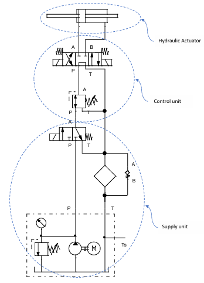

The system was controlled using:

1- Arduino microcontroller.

2- BTS7960 motor drivers (for valve actuation).

3- Signal conditioning circuits (low-pass filter, level shifter, anti-aliasing filter).

4- Position feedback via potentiometer.

- The general driving circuit dieagram:

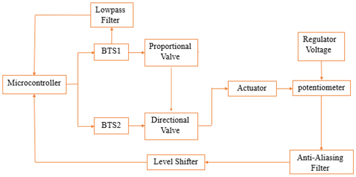

- The electronic driving circuit dieagram:

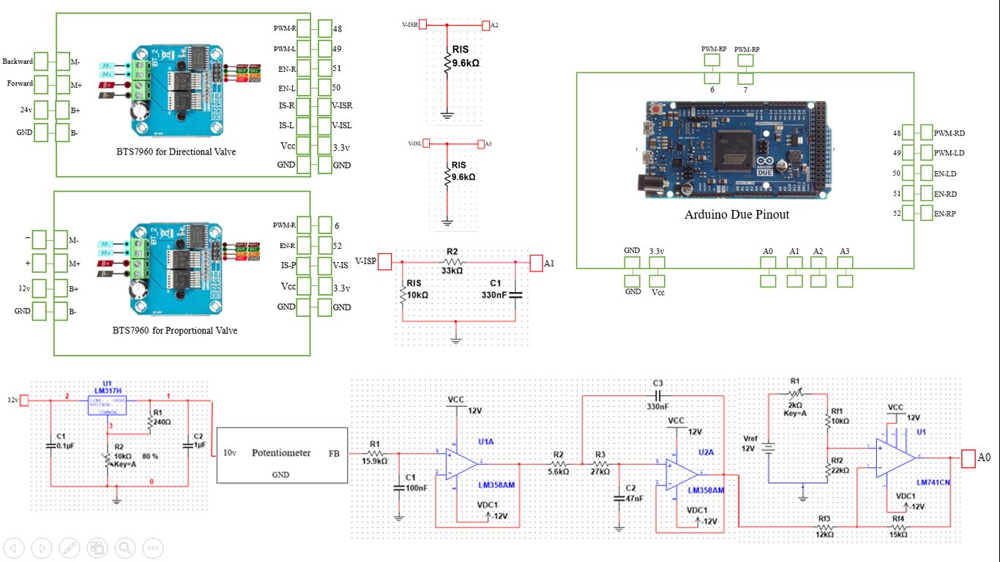

- The real driving circuit during testing:

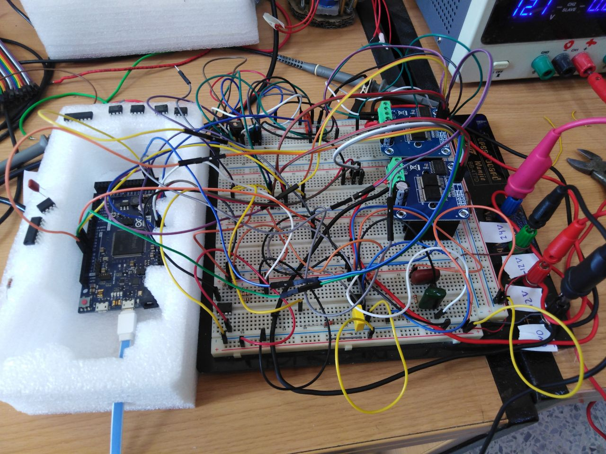

🔬 System Identification

An experimental identification procedure was conducted to obtain a linear model of the system:

1- Closed-loop identification using PRBS excitation.

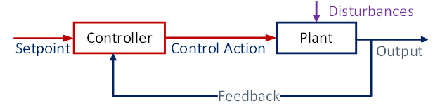

  - The identification procedure box-diagram:

    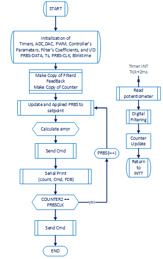

2- Data acquisition via Arduino and MATLAB.

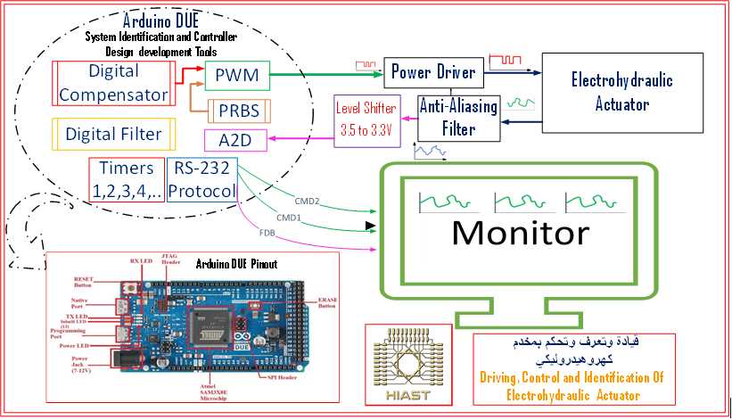

3- Model estimation using MATLAB System Identification Toolbox.

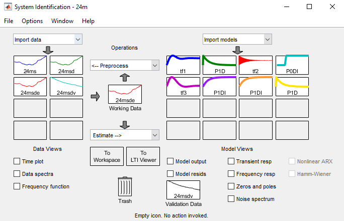

4- Achieved model accuracy of approximately 86% fit.

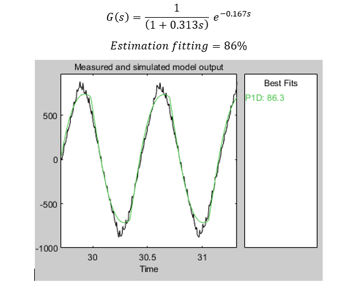

- The real work-environment in the control laboratory at HIAST:

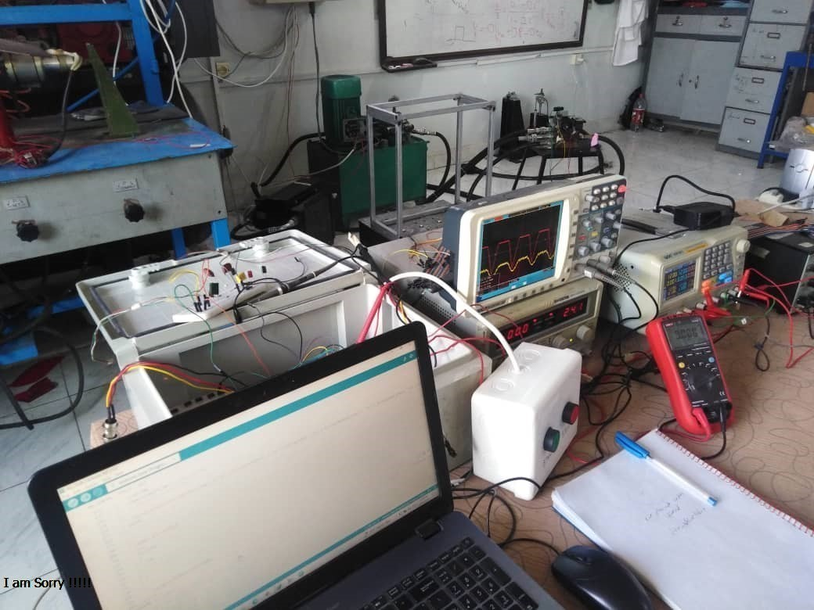

⚙️ System Modeling

A dynamic model of the electro-hydraulic system was developed in Simulink based on the identified system behavior.
To simplify the model and improve simulation accuracy, several practical approximations were introduced:

1- The system delay was approximated by an equivalent pole to simplify analysis

2- Nonlinear effects, such as the dead zone, were modeled explicitly

3- A constant offset was added to the input signal to compensate for the dead zone and ensure proper system response

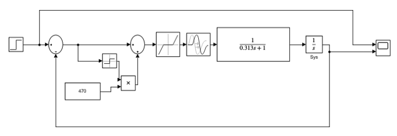

These modifications allowed for a more realistic representation of the system while maintaining a manageable model for control design.

⚙️ Control Design

A phase-lead controller was designed to meet specific performance requirements:

1- Overshoot < 4%

2- Settling time < 2 seconds

3- Zero steady-state error

The controller parameters were determined using Bode diagram analysis and validated through simulation in Simulink.

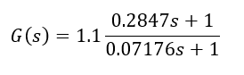

📈 Frequency and Stability Analysis

The system behavior was analyzed using frequency and root locus methods to design and validate the controller.

- Bode Diagram:

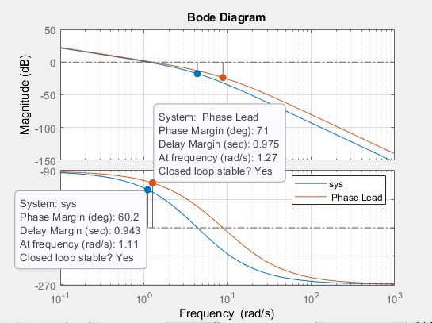

The Bode plots show improved phase margin and system bandwidth after applying the phase-lead controller.

- Root Locus:

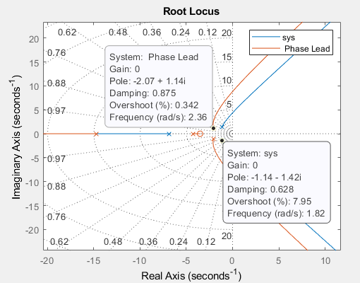

The root locus demonstrates the shift of system poles to more stable locations, resulting in improved dynamic response and stability.

📊 Simulation Results

Step Response Before (untitled1) and after (untitled2) Control:

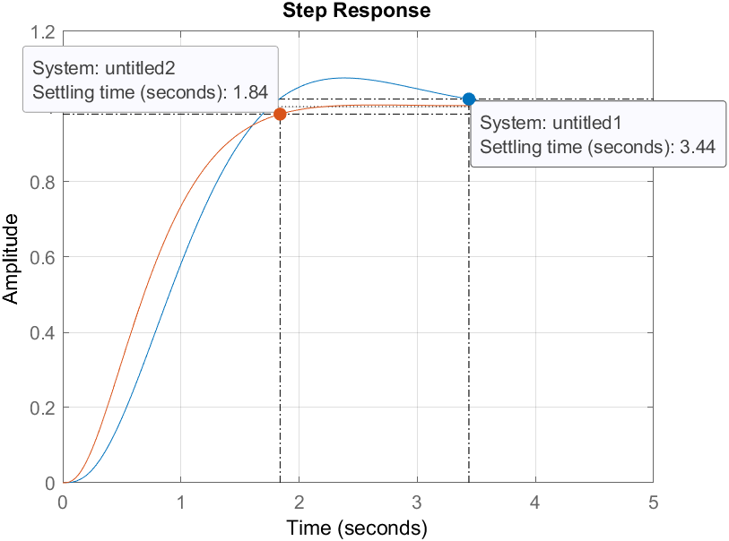

The controller successfully satisfies the design specifications:

1- Overshoot < 4%

2- Settling time < 2 seconds

3- Zero steady-state error

🧪 Experimental Validation

The designed controller was implemented on the real system to validate its performance.
The continuous-time controller and plant model were discretized using the Tustin method and implemented on the Arduino for real-time control.

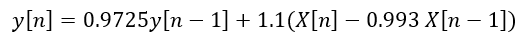

After implementation, several experiments and tuning steps were performed to achieve the desired performance.

Experimental Step Response Before and after Control:

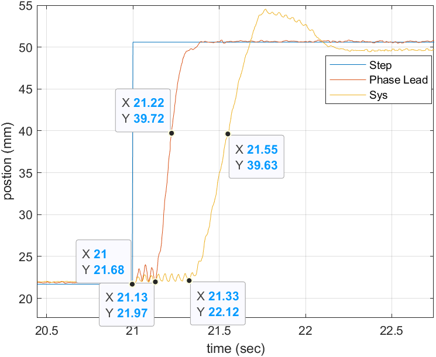

The experimental results confirm the effectiveness of the controller. The system shows a significant improvement in dynamic performance, including faster response (Settling time < 2 seconds), elimination of overshoot (Overshoot < 4%), and zero steady-state error, meeting the design requirements.

The controller significantly improved system performance:

1- Overshoot: reduced to 0%

2- Time constant: improved by 59%

3- Delay time: improved by 60%

4- Settling time: improved by 68%

5- Steady-state error: reduced to 0%

🖥️ User Interface

A graphical user interface (GUI) was developed using MATLAB App Designer to simplify system operation and testing.
The interface provides two operating modes:

🔄 Open-Loop Mode

- Manual control of actuator motion

- Direction selection (forward / backward)

- Speed control using an adjustable input

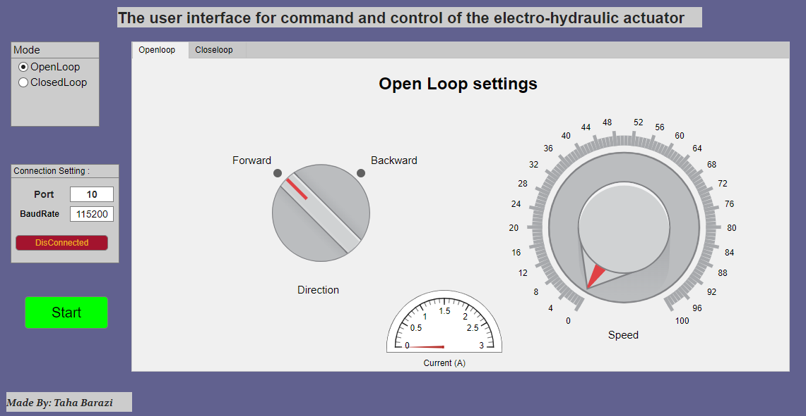

🔁 Closed-Loop Mode

Selection of input signal type:

- Step
  
- Sinusoidal
  
- Square wave
  
- Adjustable reference position within the operating range (20–50 mm)
  
- For sinusoidal input:
  
  - Frequency control (1–3 Hz)
    
  - Amplitude adjustment (0–15 mm)
    
📡 Monitoring & Control

- Real-time visualization of piston position using a graphical indicator
  
- Start/stop control for system operation
  
- Serial communication settings:
  
  - Port selection
    
  - Baud rate configuration
    
  - Connection control
 
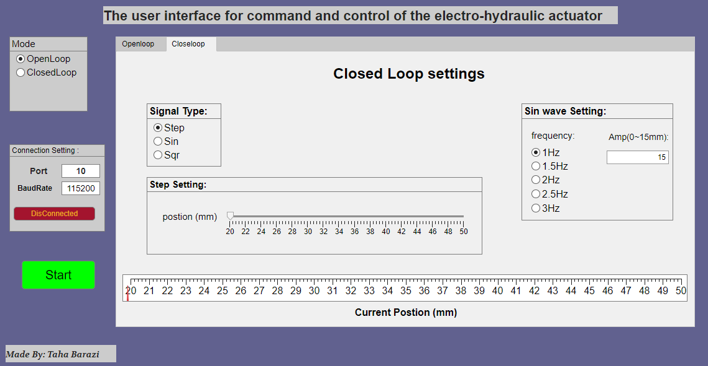

The interface enables intuitive interaction with the system and facilitates both testing and evaluation of control performance.

💻 Implementation Files  

- Arduino control code:
  
  [View Arduino Code](arduino/control_code.ino)

- MATLAB GUI application:
  
  [Download GUI Application](matlab/gui_app.mlapp)

🏫 Academic Contribution

This project has been officially archived at the Higher Institute for Applied Science and Technology (HIAST) and is used as a reference for teaching and research purposes.

🧠 Conclusion

The project demonstrates a complete control engineering workflow, from hardware design and system identification to controller implementation and validation. The results confirm the effectiveness of the proposed approach in achieving accurate and reliable position control.

📄 Full Report

A detailed version of this project is available in Arabic and has been officially archived at the Higher Institute for Applied Science and Technology (HIAST).

👉 [Download Full Report (Arabic)](report_ar.pdf)

👉 An English summary will be provided soon.

👉 Developed as part of my undergraduate studies in Aeronautical Engineering.
